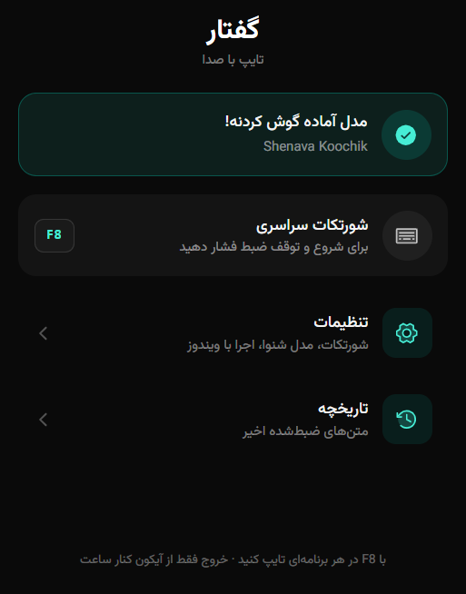
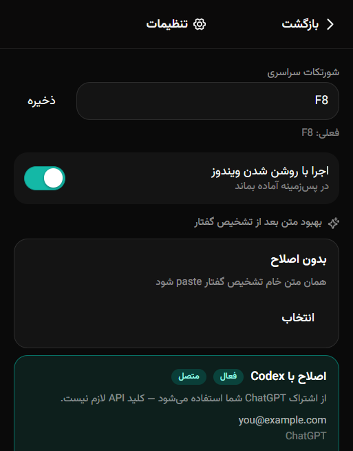

# Persian Speach Type

**Persian voice-to-text for Windows.** Speak anywhere, paste everywhere.

Hold focus in any text field, press the global hotkey, talk, press again — Persian Speach Type transcribes locally with Shenava and pastes the result into the active app.

<p align="center">
  
</p>

## Features

- **Global hotkey** (default `F8`) — start/stop dictation from any app
- **Local Shenava STT** via sherpa-onnx (no cloud required for recognition)
- **Paste into any app** — clipboard + Ctrl+V with Windows focus tracking
- **System tray** shell with home, settings, and history
- **Optional Codex correction** — polish transcripts with your ChatGPT subscription (no API key)
- **Shared models with Nimruz** — reuse installed Shenava models when present
- **Launch at login** — stay ready in the background

## Screenshots

| Home | Settings | HUD (listening) |
| :---: | :---: | :---: |
|  |  |  |

## Stack

Electron · React · Vite · Tailwind CSS · sherpa-onnx / Shenava

## Requirements

- Windows
- Node.js `>= 22.13`
- pnpm `>= 9`

## Quick start

```bash
git clone https://github.com/aminzare2005/persian-speach-type.git
cd persian-speach-type
pnpm install
pnpm dev
```

On first run, open **Settings** from the tray and download **Shenava Rizeh** (~111 MB), or use a model already installed by Nimruz.

## Scripts

| Command | Description |
| --- | --- |
| `pnpm dev` | Vite + Electron main watch + app |
| `pnpm build` | Production renderer + Electron bundle |
| `pnpm dist` | Build and package Windows installer (`release/`) |
| `pnpm dist:dir` | Unpackaged win-unpacked dir (faster local check) |
| `pnpm typecheck` | TypeScript (`tsc --noEmit`) |
| `pnpm version:patch` / `minor` / `major` | Bump `package.json` version (no git tag) |

## Releases

- App / npm version lives in `package.json` (`1.0.0` and up).
- Git tags use `vMAJOR.MINOR.PATCH` (example: `v1.0.0`).
- Installer name: `Persian Speach Type-Setup-<version>.exe` under `release/`.
- See [CHANGELOG.md](CHANGELOG.md) for release notes.

## Configuration & models

- Settings live in the app panel (tray → Settings): hotkey, launch at login, Shenava model, correction provider.
- Models are stored under `%APPDATA%\persian-speach-type\models\`.
- If Nimruz is installed, Persian Speach Type can pick up models from `%APPDATA%\Nimruz\models\`.
- Codex correction uses a local Codex/ChatGPT login — not an OpenAI API key.
- After the rebrand, user data starts fresh under `persian-speach-type` (previous profile data is not migrated automatically).

## Docs

- [CONTRIBUTING.md](CONTRIBUTING.md) — setup, PNPM, PR tips
- [AGENTS.md](AGENTS.md) — guidance for AI coding agents
- [SECURITY.md](SECURITY.md) — vulnerability reporting
- [LICENSE](LICENSE) — MIT

## License

MIT © Amin
